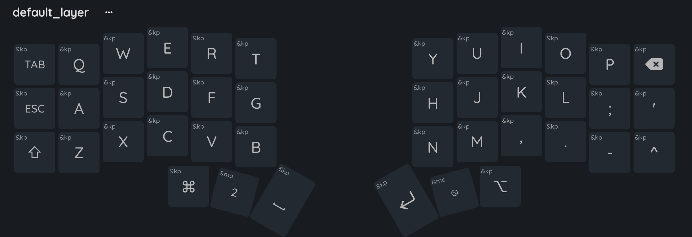
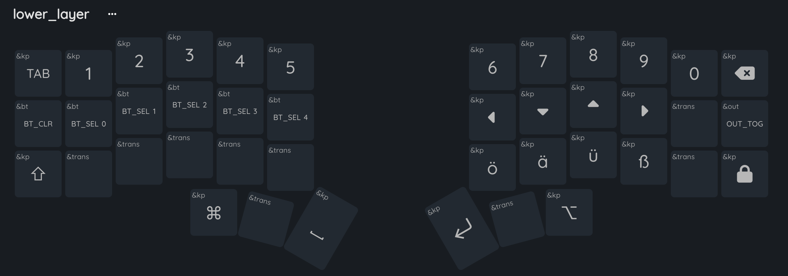
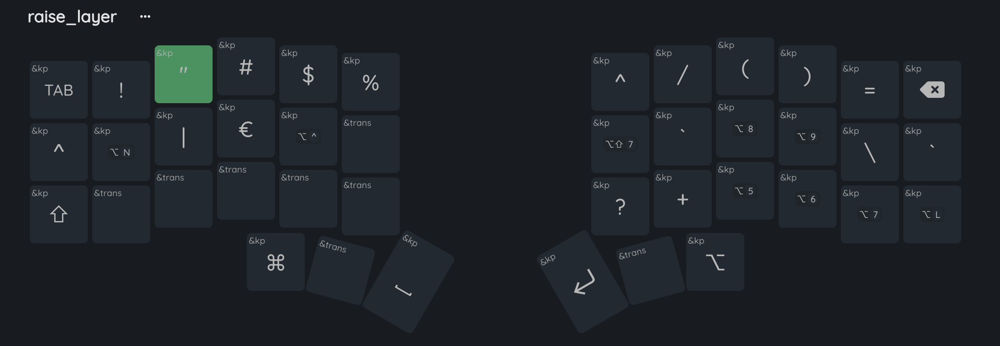

### Zmk Config

This repo contains my config for the aurora corne by splitkb.com

### Assembled

### Config overview.

( Some keys are inaccurate due to on device translation )

### Notes
- The keymap was made with german language support in mind
- Also has key translation through DE in mind
